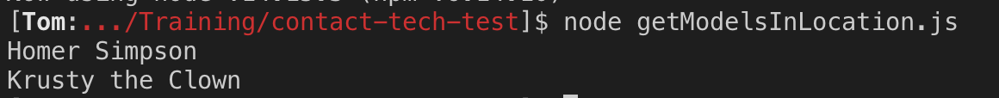
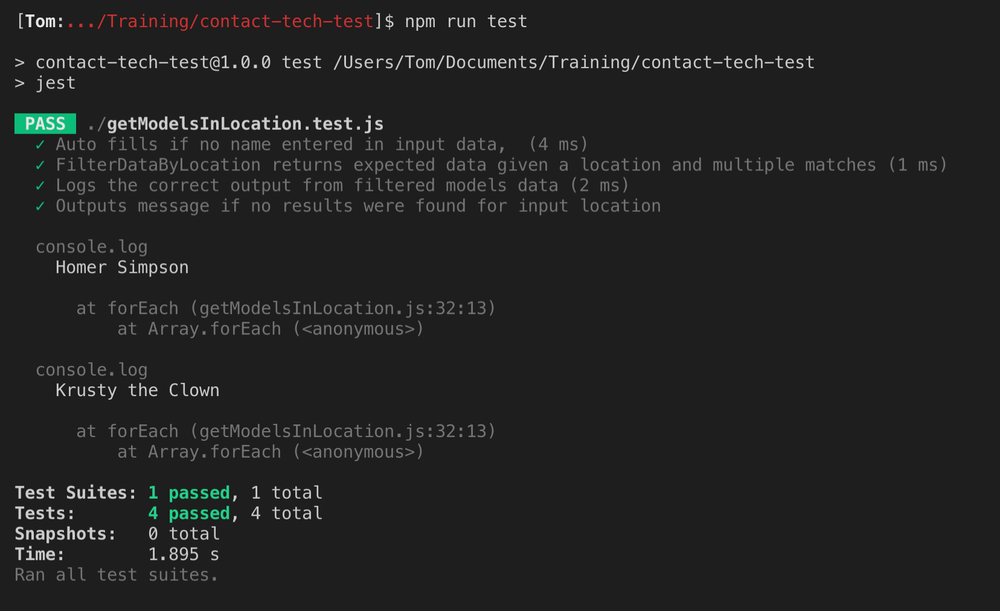

# Contact-tech-test

 [Objective](#objective) | [Tools Used](#Tools-Used) | [How To Run](#How-To-Run) | [Screenshots](#Screenshots) | [Improvements](#improvements)

## Objective

We'd like you to build a program that accepts two inputs:

- A JSON array of talent, containing objects with `name`, `location` and `date_of_birth` attributes
- A location to filter by

The program should then filter the array of supplied talent, and output the names of talent whose location matches the location supplied. The supplied location should be consider case-insensitive, and the order in which names are outputted is not important.

## Example

For example, given:

- The following JSON data:

```
[
  {
    "name": "Homer Simpson",
    "location": "Springfield",
    "date_of_birth": "1956-05-12"
  },
  {
    "name": "Frank Reynolds",
    "location": "Philidelphia",
    "date_of_birth": "1944-11-17"
  },
  {
    "name": "Diane Nguyen",
    "location": "Los Angeles",
    "date_of_birth": "1980-03-19"
  },
  {
    "name": "Krusty the Clown",
    "location": "SpringField",
		"date_of_birth": "1957-10-29"
  }
]
```

- A location of `Springfield`

Your program should output:

```jsx
Homer Simpson
Krusty the Clown
```

## Tools Used

[Javascript](https://www.javascript.com/) \
[Jest](https://jestjs.io/)

## How To Run

Clone the repo and go to the directory \
`git@github.com:Mnargh/contact-tech-test.git && cd contact-tech-test`

Ensure you have [Node.js](https://nodejs.org/en/) installed (tested on version 14.14.3 and upwards)

Install dependencies \
`npm i`

To run tests \
`npm run test`

To run the program \
`node getModelsInLocation.js`

## Screenshots






## Improvements

Given more time, there are a number of improvements I would add:

1. Use ES6 syntax to import/export functions. I was having difficulty with installing and using Babel with jest so used ES5 "require" in the interest of time.

2. Modify the program so that you could feed in the input data when running the program in the command line, instead of hard-coding what is run in the current file.

3. Parameterise the filtering function so that it could be adapted to filter by any criteria, instead of only by location

4. Consider separating out some of the functions into different files according to responsibility if the complexity, and features of the program grew.